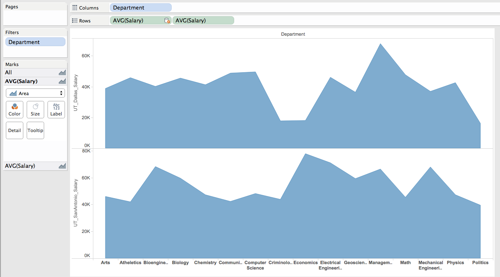
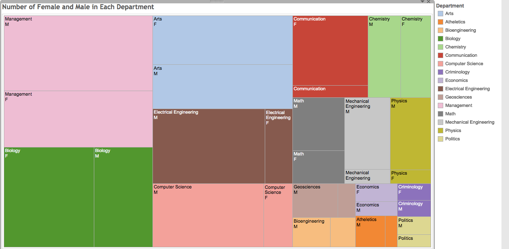

## DV_TableauProject3
========================================================
#### Group member: Anna Mengjie Yu (my3852),  Duy Vu (dhv242),  Syed Naqvi (san724)
In this project, we used data downloaded from Texas Tribute website. 
Those dataset includes employee Name, Department, Job, Salary, Sex, Ethnic and Start date. 
Those dataset are from UT Dallas and UT San Antonio.

*********
**Showing Tables**

Our datasets are showing below.

Those two tables are uploaded to Oracle Database, named UTDallas and UTSanAntonio,respectively.

UTSanAntonio is listed as primary data source, UTDallas is listed as secondary data source.

Those two tables are blended by Department, Ethnic and Sex (Using Edit Relationship in Tableau)

*********
**Figure 1: Average Salary in Each Department**

Method:

1. Drag Department to Cololumns

2. Drag UTDallas Salary to Row. Change Measure to Average

3. Drag UTSanAntonio Salary to Row, keep it in 2nd place. Change Measure to Average.

4. In Mark window, change the shape to Area.

  From Figure 1, we can see that the salary in different department varies. 
  
  Also salary in different campus but same department also varies. 
  
  In UT Dallas, the Management Department has the highest salary; In UT San Antonio, the Economics department has the highest salary.

*********
**Figure 2: Count of Employee in Different Ethnicity in Each Department**

Method:

1. Drag Department to Columns

2. Drag Ethnic from UTDallas to Row. Change Measure to CNT.

3. Drag Ethnic from UTSanAntonio to Row. Change Measure to CNT.

4. Exclude departments only show up in one table not the other.

5. Drag Ethnic to Color.

6. In Marks window, change shape to Bar.

From Figure 2, we can see that in both UT Dallas and UT San Antonio, the majority of employees are white.

In Computer Science department, Asian employee numbers are more or at least equal to employees from other ethnic background. 

In Art department, the majority employees are white, which is the same case in both UT Dallas and UT San Antonio.

*********
**Figure 3: Number of Female and Male Emoloyees in Different Department**

Method:

1. Drag Department to Column.

2. Drag NumberOfRecord in UTDallas to Row.

3. Drag NumberOfRecord in UTSanAntonio to Row.

4. Drag Sex to Color.

5. Change shape to Line.

In Figure 3, the blue line indicates the number of Male employees, the red line indicates the number of Famele Employees.

We can see that in both UT Dallas and UT San Antonio, the CS and EE departments has more Male employees than Female employees. This is similar to Tech industry, where woman are way under represented.

In Art department, female employees outweight the number of male employees.

**TreeMap**

We also showed the employee female and male ratio in different department in treemap.

Method:

(Modified based above line graph)

1. Click on Show Me, click on TreeMap.

2. Drag Department to ABC.

3. Drag Sex to ABC.

4. Drag Department to color.

5. Drag CNT(SEX) to Size.

*********
**Figure 4: Professor Salary Comparison Table**

Method: 

1. Drag Job to column.

2. Drag UT Dallas Salary to row.

3. Drag UT SanAntonio Salary to row.

4. Drag Job to filter, using wildcard only selecting job contains "professor"

5. Drag this sheet to Dashboard, edit the titles on top

From Figure 5, we can see that generally, there is a trend that

Professor Salary > Associate professor Salary > Assistant professor salary > Visiting professor Salary

The professor salary differs, probably due to different department.

